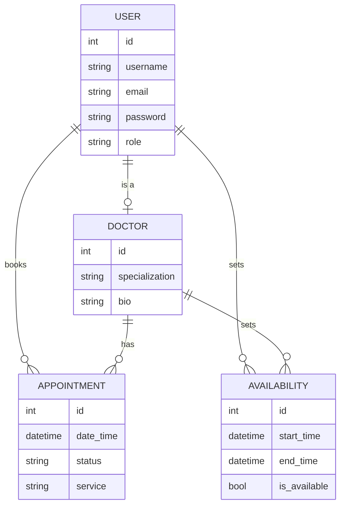

# Dr.slot

[](https://www.github.com/Bruce0C/dr.slot/commits/main)
[](https://www.github.com/Bruce0C/dr.slot/commits/main)
[](https://www.github.com/Bruce0C/dr.slot)
[](https://drslot-e9b130b994da.herokuapp.com)

dr.slot is a Django-based web application designed to manage appointments for healthcare services. The project allows users to book appointments for various services such as doctor care and nursing care. It provides a simple and user-friendly interface for both users and administrators to manage appointments efficiently.


source: [dr.slot amiresponsive](https://ui.dev/amiresponsive?url=https://drslot-e9b130b994da.herokuapp.com)


## UX

### The 5 Planes of UX

**1. Strategy**

 - **Purpose**
     - Provide healthcare providers with tools to manage appointments and availability efficiently.
     - Offer patients an intuitive platform to book, reschedule, or cancel appointments.
     - Enable administrators to oversee and manage users, appointments, and services.

**Primary User Needs**
- Patients need a seamless way to book, view, reschedule, or cancel appointments.
- Doctors need tools to manage their availability and appointments.
- Admins need the ability to manage users, appointments, and services.

**Business Goals**
- Build a reliable appointment management system that fosters trust between patients and healthcare providers.
- Streamline the process of booking and managing appointments for both patients and doctors.
- Provide a scalable and user-friendly platform that can handle multiple users and services.

**2. Scope**

**Features**
- User authentication and role-based access (patients, doctors, admins).
- Appointment booking, rescheduling, and cancellation for patients.
- Availability management for doctors.
- Admin dashboard for managing users, appointments, and services.
- Email notifications for appointment confirmations, reminders, and updates.
- Error handling (e.g., 404 error page for invalid URLs).

**Content Requirements**
- Appointment details (date, time, service, doctor, and patient).
- User account management (register, log in, reset password).
- Doctor availability schedules.
- Admin tools for managing users, appointments, and services.

**3. Structure**

**Information Architecture**

- **Navigation Menu:**
     - Links to Home, Appointments, Login/Register, and Admin Dashboard (for admins).
- **Hierarchy:**
     - Appointment booking and management features are prioritized for patients.
     - Doctors have access to availability and appointment management tools.
     - Admins have access to a dashboard for managing users, appointments, and services.

**User Flow**

1. Patients register for an account → log in to book an appointment.
2. Patients view available services and time slots → select a service, date, and time.
3. Patients receive confirmation and reminders via email.
4. Doctors log in to manage their availability and view appointments.
5. Admins log in to manage users, appointments, and services.

**4. Skeleton**

**Wireframes**

- **Homepage:**
     - Clear call-to-action buttons for booking appointments and logging in.
     - Overview of available services and doctors.
- **Patient Dashboard:**
     - List of upcoming appointments with options to reschedule or cancel.
     - Button to book a new appointment.
- **Doctor Dashboard:**
     - Calendar view of appointments.
    - Interface for setting availability.
- **Admin Dashboard:**
     - User management section (view, add, edit, delete users).
     - Appointment management section (view, filter, export appointments).
     - Service management section (add, edit, delete services).

**5. Surface**
**Visual Design Elements**

- **Colours:**
     - Use a clean and professional color scheme (e.g., blue and white) to convey trust and reliability.
- **Typography:**
     - Use a modern, readable font (e.g., Open Sans or Roboto) for clarity.
- **Icons and Buttons:**
     - Use intuitive icons for actions like booking, editing, and canceling appointments.
     - Clear and accessible buttons for primary actions (e.g., "Book Appointment," "Log In").
- **Responsive Design:**
     - Ensure the platform is mobile-friendly and adapts to different screen sizes.

### Colour Scheme

I used [coolors.co](https://coolors.co/080708-3772ff-df2935-fdca40-e6e8e6) to generate my color palette.

- `#` primary text.
- `#` primary highlights.
- `#` secondary text.
- `#` secondary highlights.


### Typography

- [...](https://fonts.google.com/specimen/Montserrat) was used for the primary headers and titles.
- [...](https://fonts.google.com/specimen/Lato) was used for all other secondary text.
- [Font Awesome](https://fontawesome.com) icons were used throughout the site.

## Wireframes

To follow best practice, wireframes were developed for mobile, tablet, and desktop sizes.
I've used [Balsamiq](https://balsamiq.com/wireframes) to design my site wireframes.

| Page | Mobile | Tablet | Desktop |
| --- | --- | --- | --- |
| Register |  |  |  |
| Login |  |  |  |
| Home |  |  |  | 
| Appointments |  |  |  |

## User Stories

| Target | Expectation | Outcome |
| --- | --- | --- |
|As a patient| I want to create an account |so that I can log in and manage my appointments.|
|As a patient| I want to log in to my account| so that I can view my upcoming appointments.|
|As a user| I want to reset my password if I forget it |so that I can regain access to my account.|
|As a patient| I want to book an appointment with a doctor or healthcare provider |so that I can receive medical care.|
|As a patient| I want to reschedule or cancel my appointment |so that I can manage my schedule effectively.|
|As a patient| I want to receive email notifications for my appointment confirmation and reminders |so that I don’t miss my appointments.|
|As an admin| I want to manage user accounts (patients and doctors) |so that I can ensure the system is used appropriately.|
|As an admin| I want to view all appointments in the system |so that I can monitor the overall schedule.|
|As a user| I want the website to be mobile-friendly |so that I can access it on my phone or tablet.|
|As a user| I want the system to load quickly |so that I can access information without delays. |

## Features

### Existing Features

| Feature | Notes | Screenshot |
| --- | --- | --- |
| Register account | Authentication is handled by allauth, allowing users to register accounts. |  |
| Login | Authentication is handled by allauth, allowing users to log in to their existing accounts. |  |
| Logout | Authentication is handled by allauth, allowing users to log out of their accounts. |  |
| 404 | The 404 error page will indicate when a user has navigated to a page that doesn't exist, replacing the default Heroku 404 page with one that ties into the site's look and feel. |  |

### Future Features

- **Appointment Reviews:** Allow patients to leave reviews and ratings for doctors after their appointments, helping other users make informed decisions.
- **Search and Filter:** Enable users to search for doctors or services and filter results by availability, location, or specialization.
- **Appointment History:** Allow patients and doctors to view a detailed history of past appointments.
- **Push Notifications:** Implement push notifications for appointment reminders and updates.
- **Waitlist Management:** Allow patients to join a waitlist for earlier appointment slots if they become available.

## Tools & Technologies

| Tool / Tech | Use |
| --- | --- |
| [](https://markdown.2bn.dev) | Generate README and TESTING templates. |
| [](https://git-scm.com) | Version control. (`git add`, `git commit`, `git push`) |
| [](https://github.com) | Secure online code storage. |
| [](https://en.wikipedia.org/wiki/HTML) | Main site content and layout. |
| [](https://en.wikipedia.org/wiki/CSS) | Design and layout. |
| [](https://www.javascript.com) | User interaction on the site. |
| [](https://www.python.org) | Back-end programming language. |
| [](https://www.heroku.com) | Hosting the deployed back-end site. |
| [](https://www.djangoproject.com) | Python framework for the site. |
| [](https://www.postgresql.org) | Relational database management. |

## Database Design

### Data Model

Entity Relationship Diagrams (ERD) help to visualize database architecture before creating models. Understanding the relationships between different tables can save time later in the project.


I have used `Mermaid` to generate an interactive ERD of my project.


source: [Mermaid]()

I have used `pygraphviz` and `django-extensions` to auto-generate an ERD.

The steps taken were as follows:
- In the terminal: `sudo apt update`
- then: `sudo apt-get install python3-dev graphviz libgraphviz-dev pkg-config`
- then type `Y` to proceed
- then: `pip3 install django-extensions pygraphviz`
- in my `settings.py` file, I added the following to my `INSTALLED_APPS`:
```python
INSTALLED_APPS = [
    ...
    'django_extensions',
    ...
]
```
- back in the terminal: `python3 manage.py graph_models -a -o erd.png`
- drag the new `erd.png` file into my `documentation/` folder
- removed `'django_extensions',` from my `INSTALLED_APPS`
- finally, in the terminal: `pip3 uninstall django-extensions pygraphviz -y`


source: [medium.com](https://medium.com/@yathomasi1/1-using-django-extensions-to-visualize-the-database-diagram-in-django-application-c5fa7e710e16)

## Agile Development Process

### GitHub Projects

[GitHub Projects](https://www.github.com/Bruce0C/dr.slot/projects) served as an Agile tool for this project. Through it, EPICs, User Stories, issues/bugs, and Milestone tasks were planned, then subsequently tracked on a regular basis using the Kanban project board.


### GitHub Issues

[GitHub Issues](https://www.github.com/Bruce0C/dr.slot/issues) served as an another Agile tool. There, I managed my User Stories and Milestone tasks, and tracked any issues/bugs.

| Link | Screenshot |
| --- | --- |
| [](https://www.github.com/Bruce0C/dr.slot/issues?q=is%3Aissue%20is%3Aopen%20-label%3Abug) |  |
| [](https://www.github.com/Bruce0C/dr.slot/issues?q=is%3Aissue%20is%3Aclosed%20-label%3Abug) |  |

### MoSCoW Prioritization

I've decomposed my Epics into User Stories for prioritizing and implementing them. Using this approach, I was able to apply "MoSCoW" prioritization and labels to my User Stories within the Issues tab.

- **Must Have**: guaranteed to be delivered - required to Pass the project (*max ~60% of stories*)
- **Should Have**: adds significant value, but not vital (*~20% of stories*)
- **Could Have**: has small impact if left out (*the rest ~20% of stories*)
- **Won't Have**: not a priority for this iteration - future features

## Testing

> [!NOTE]  
> For all testing, please refer to the [TESTING.md](TESTING.md) file.

## Deployment

The live deployed application can be found deployed on [Heroku](https://drslot-e9b130b994da.herokuapp.com).

### Heroku Deployment

This project uses [Heroku](https://www.heroku.com), a platform as a service (PaaS) that enables developers to build, run, and operate applications entirely in the cloud.

Deployment steps are as follows, after account setup:

- Select **New** in the top-right corner of your Heroku Dashboard, and select **Create new app** from the dropdown menu.
- Your app name must be unique, and then choose a region closest to you (EU or USA), then finally, click **Create App**.
- From the new app **Settings**, click **Reveal Config Vars**, and set your environment variables to match your private `env.py` file.

> [!IMPORTANT]  
> This is a sample only; you would replace the values with your own if cloning/forking my repository.

| Key | Value |
| --- | --- |
| `CLOUDINARY_URL` | user-inserts-own-cloudinary-url |
| `DATABASE_URL` | user-inserts-own-postgres-database-url |
| `DISABLE_COLLECTSTATIC` | 1 (*this is temporary, and can be removed for the final deployment*) |
| `SECRET_KEY` | any-random-secret-key |

Heroku needs some additional files in order to deploy properly.

- [requirements.txt](requirements.txt)
- [Procfile](Procfile)
- [.python-version](.python-version)

You can install this project's **[requirements.txt](requirements.txt)** (*where applicable*) using:

- `pip3 install -r requirements.txt`

If you have your own packages that have been installed, then the requirements file needs updated using:

- `pip3 freeze --local > requirements.txt`

The **[Procfile](Procfile)** can be created with the following command:

- `echo web: gunicorn app_name.wsgi > Procfile`
- *replace `app_name` with the name of your primary Django app name; the folder where `settings.py` is located*

The **[.python-version](.python-version)** file tells Heroku the specific version of Python to use when running your application.

- `3.12` (or similar)

For Heroku deployment, follow these steps to connect your own GitHub repository to the newly created app:

Either (*recommended*):

- Select **Automatic Deployment** from the Heroku app.

Or:

- In the Terminal/CLI, connect to Heroku using this command: `heroku login -i`
- Set the remote for Heroku: `heroku git:remote -a app_name` (*replace `app_name` with your app name*)
- After performing the standard Git `add`, `commit`, and `push` to GitHub, you can now type:
	- `git push heroku main`

The project should now be connected and deployed to Heroku!

### PostgreSQL

This project uses a [Code Institute PostgreSQL Database](https://dbs.ci-dbs.net) for the Relational Database with Django.

> [!CAUTION]
> - PostgreSQL databases by Code Institute are only available to CI Students.
> - You must acquire your own PostgreSQL database through some other method if you plan to clone/fork this repository.
> - Code Institute students are allowed a maximum of 8 databases.
> - Databases are subject to deletion after 18 months.

To obtain my own Postgres Database from Code Institute, I followed these steps:

- Submitted my email address to the CI PostgreSQL Database link above.
- An email was sent to me with my new Postgres Database.
- The Database connection string will resemble something like this:
    - `postgres://<db_username>:<db_password>@<db_host_url>/<db_name>`
- You can use the above URL with Django; simply paste it into your `env.py` file and Heroku Config Vars as `DATABASE_URL`.

### Local Development

This project can be cloned or forked in order to make a local copy on your own system.

For either method, you will need to install any applicable packages found within the [requirements.txt](requirements.txt) file.

- `pip3 install -r requirements.txt`.

You will need to create a new file called `env.py` at the root-level, and include the same environment variables listed above from the Heroku deployment steps.

> [!IMPORTANT]  
> This is a sample only; you would replace the values with your own if cloning/forking my repository.

Sample `env.py` file:

```python
import os

os.environ.setdefault("SECRET_KEY", "any-random-secret-key")
os.environ.setdefault("DATABASE_URL", "user-inserts-own-postgres-database-url")
os.environ.setdefault("CLOUDINARY_URL", "user-inserts-own-cloudinary-url")  # only if using Cloudinary

# local environment only (do not include these in production/deployment!)
os.environ.setdefault("DEBUG", "True")
```

Once the project is cloned or forked, in order to run it locally, you'll need to follow these steps:

- Start the Django app: `python3 manage.py runserver`
- Stop the app once it's loaded: `CTRL+C` (*Windows/Linux*) or `⌘+C` (*Mac*)
- Make any necessary migrations: `python3 manage.py makemigrations --dry-run` then `python3 manage.py makemigrations`
- Migrate the data to the database: `python3 manage.py migrate --plan` then `python3 manage.py migrate`
- Create a superuser: `python3 manage.py createsuperuser`
- Load fixtures (*if applicable*): `python3 manage.py loaddata file-name.json` (*repeat for each file*)
- Everything should be ready now, so run the Django app again: `python3 manage.py runserver`

If you'd like to backup your database models, use the following command for each model you'd like to create a fixture for:

- `python3 manage.py dumpdata your-model > your-model.json`
- *repeat this action for each model you wish to backup*
- **NOTE**: You should never make a backup of the default *admin* or *users* data with confidential information.

#### Cloning

You can clone the repository by following these steps:

1. Go to the [GitHub repository](https://www.github.com/Bruce0C/dr.slot).
2. Locate and click on the green "Code" button at the very top, above the commits and files.
3. Select whether you prefer to clone using "HTTPS", "SSH", or "GitHub CLI", and click the "copy" button to copy the URL to your clipboard.
4. Open "Git Bash" or "Terminal".
5. Change the current working directory to the location where you want the cloned directory.
6. In your IDE Terminal, type the following command to clone the repository:
	- `git clone https://www.github.com/Bruce0C/dr.slot.git`
7. Press "Enter" to create your local clone.

Alternatively, if using Ona (formerly Gitpod), you can click below to create your own workspace using this repository.

[](https://gitpod.io/#https://www.github.com/Bruce0C/dr.slot)

**Please Note**: in order to directly open the project in Ona (Gitpod), you should have the browser extension installed. A tutorial on how to do that can be found [here](https://www.gitpod.io/docs/configure/user-settings/browser-extension).

#### Forking

By forking the GitHub Repository, you make a copy of the original repository on our GitHub account to view and/or make changes without affecting the original owner's repository. You can fork this repository by using the following steps:

1. Log in to GitHub and locate the [GitHub Repository](https://www.github.com/Bruce0C/dr.slot).
2. At the top of the Repository, just below the "Settings" button on the menu, locate and click the "Fork" Button.
3. Once clicked, you should now have a copy of the original repository in your own GitHub account!

### Local VS Deployment

There are no remaining major differences between the local version when compared to the deployed version online.

## Credits

### Content
| Source | Notes |
| --- | --- |
| [Markdown Builder](https://markdown.2bn.dev) | Help generating Markdown files |
| [Chris Beams](https://chris.beams.io/posts/git-commit) | "How to Write a Git Commit Message" |
| [Bootstrap](https://getbootstrap.com) | Various components / responsive front-end framework |
| [Whitenoise](https://whitenoise.readthedocs.io) | Static file service |
| [Python Tutor](https://pythontutor.com) | Additional Python help |
| [ChatGPT](https://chatgpt.com) | Help with code logic and explanations |

### Media

| Source | Notes |
| --- | --- |
| [favicon.io](https://favicon.io) | Generating the favicon |
| [Font Awesome](https://fontawesome.com) | Icons used throughout the site |
| [Pexels](https://images.pexels.com/photos/416160/pexels-photo-416160.jpeg) | Hero image |

### Acknowledgements

- I would like to thank my Code Institute mentor, [Tim Nelson](https://www.github.com/TravelTimN) for the support throughout the development of this project.